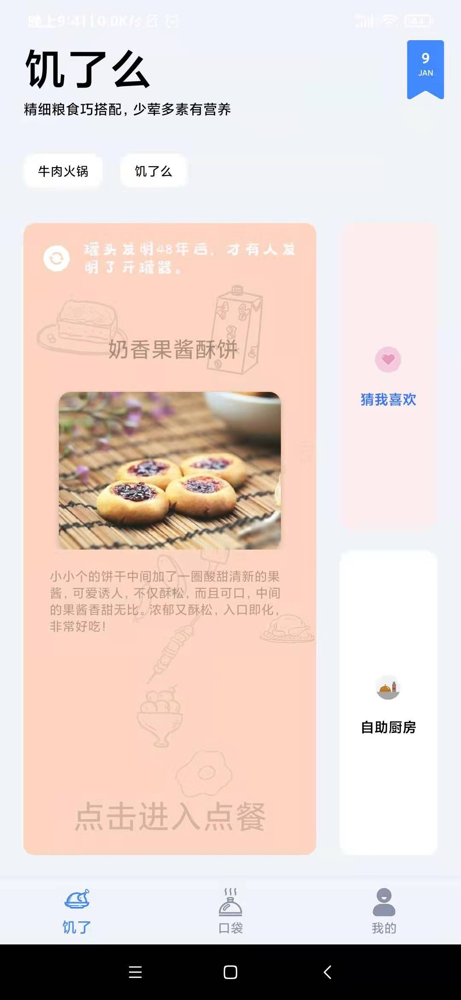
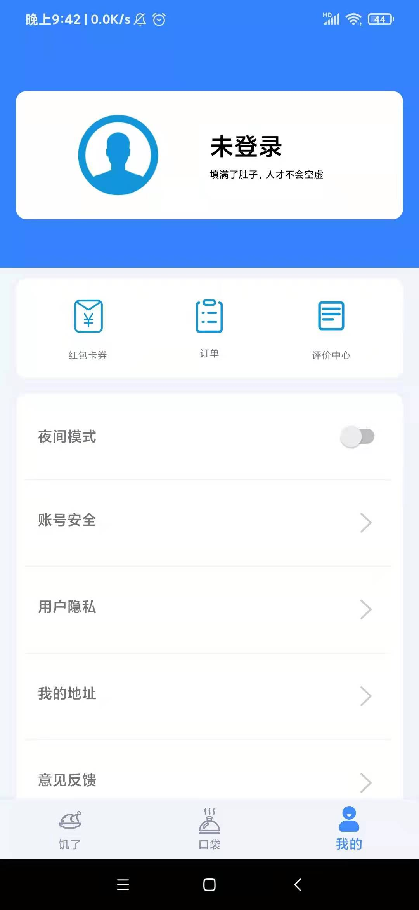

# fishei 饥了么外卖APP

 ```java
 这是的我们大学的Android课设，客户端使用Android Studio编译器，Kotlin为主要语言。
 
 后端因为后面服务器变更忘记备份了，那些原来的数据接口不能用的。
 ```

#### 更多功能请参考文件《饥了么外卖报告.docx》

| 系统组成部分         | 功能概括       | 完成情况 |
| -------------------- | -------------- | -------- |
| 服务器               | 验证码登录接口 | 完成     |
| 密码登录接口         | 完成           |          |
| 增查收货地址接口     | 完成           |          |
| 商品展示接口         | 完成           |          |
| 商品查询接口         | 完成           |          |
| 静态资源下载         | 完成           |          |
| 客户端               | 登陆操作       | 完成     |
| 退出登录             | 完成           |          |
| 启动页广告           | 完成           |          |
| 基本的对商品的浏览   | 完成           |          |
| 商品的查询           | 完成           |          |
| 购物车查询           | 完成           |          |
| 查询收货地址         | 完成           |          |
| 移动信息推送         | 完成           |          |
| 夜间模式             | 完成           |          |
| 智能推荐（猜我喜欢） | 未完成         |          |
| 自助厨房（自定义菜） | 未完成         |          |

 

```java
后端：
	运用SpringBoot
	阿里云Linux 
	Nginx
	Https技术
	接口数据令牌传输
	私密数据MD5加密
前端：
	运用MVVM框架
	运用RecycleView实现页面滑动列表
	运用cardView卡片式布局 
	运用SQLite实现用户部分信息的存储 
	运用SharedPreferences文件存储功能 
	运用库Retrofit发送网络请求解析数据
	运用Material Design进行UI界面开发
	运用Glide库进行网络图片读取
	网络数据实现双向绑定 
	运用腾讯云消息推送机制
	运用腾讯云云短信
	Kotlin协程 
	Kotlin特殊函数 

协作工具：git
平台：gitee
```





